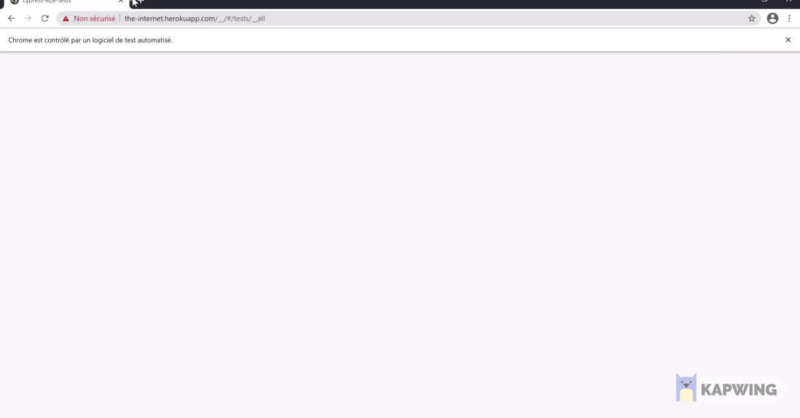

# Cypress-E2E-Tests

An example project using the automation tool, [Cypress](https://www.cypress.io/). These tests are quite simple but are intended to provide examples of common actions you may need in your testing. I've included:
- page objects
- api tests
- various ways of running the tests (via npm scripts)

## Requires
1. [node](https://nodejs.org/en/)
1. [git](https://git-scm.com/)

## Setup
1. clone: `git@github.com:Ghada-1992/cypress-e2e-tests.git`
1. install: `npm i`

## Run Tests
1. all the tests: `npm test`
2. just the login tests: `npm run cy:login`
3. headless: `npm run cy:headless`

